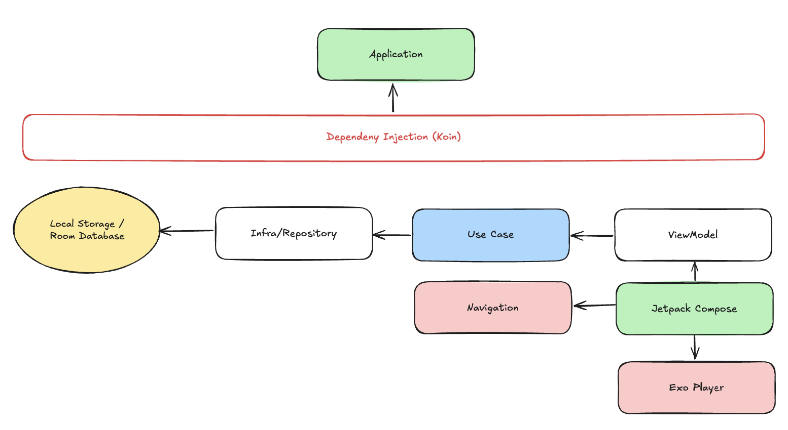
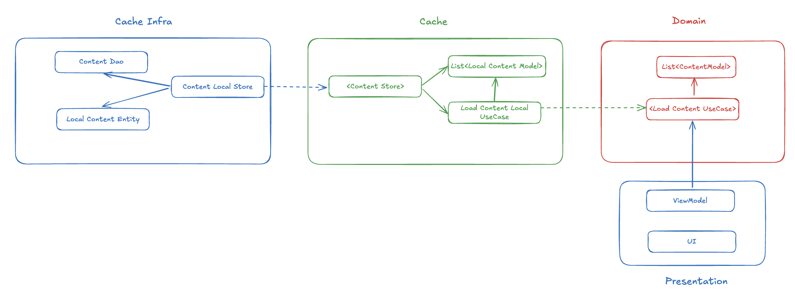

# Simple Player

## Description
```
Simple Player is an application designed to provide a seamless content-watching experience, allowing users to view a list of content, play videos.
```

## Requirements
### The Requirement
- Watching content
### Feature
- List Content
- Player Content

## Functional Requirements
- Save content to local first
- Show List Content from local
- Play content in details

## Non Functional Requirements
- Offline once show the list content
- Online once play the content


## High Level Architecture Design


## Low Level Architecture Design
